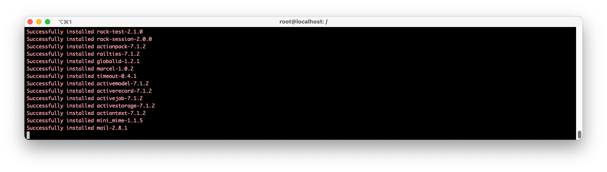

# download zerotermux
1. change mirror and use proot-distro install ubuntu and login then sshd
---
>1.1 here add some needed packages for ubuntu : vim ruby-dev build-essential ...
---
>1.2 `more important``: your phone and your PC 
should at same wifi
---
2. download ruby and rails 
---
3. SEE this `imgs`

# AFTER
1. ha, it seems my phone Redmi 9a is shit
